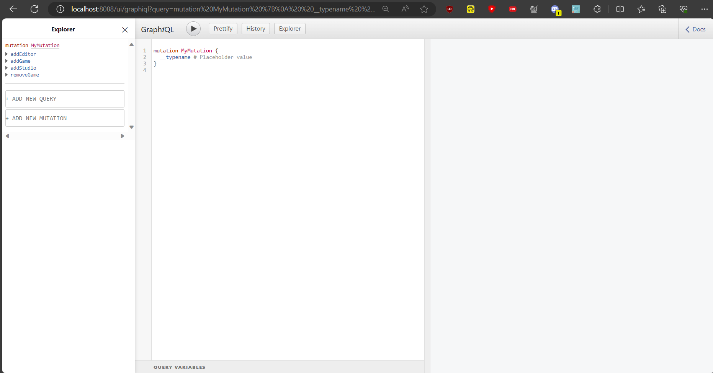

# API GraphQL jeux-vidéo

## Description du Projet

Cette API fournie des opérations CRUD pour la gestion de jeux-vidéo, des studios et des editeurs qui ont participées à sa création.
Les données sont sauvegardées dans un fichier DB SqLite en local sur la machine.

## Screenshot



## Prérequis

Posséder Docker-Desktop

## Installation

Build le Dockerfile à la racine du dépot avec la commande :

```bash
docker build -t app-dotnet .
```

Lancer ensuite l'image Docker avec la commande :

```bash
docker run -p 8088:80 app-dotnet
```

Vous pouvez ensuite vous rendre sur l'interface graphique de l'API à l'adresse :
<a href="http://localhost:8088/ui/graphiql" target="_blank">localhost:8088/ui/graphiql</a>

Lac page de GraphiQl apparaît sur laquelle vous pouvez tester l'intégralité des endpoints. Voici quelques données au format GraphQL que vous pouvez ajouter avec les mutations ADD :

```graphql
mutation MyMutation {
  __typename
  addGame(
    game: {
      id: 10
      name: "Super Mario 64"
      genres: ["plateforme", "enfant"]
      publicationDate: "23/06/1996"
      editorsId: [1]
      studiosId: [1]
      platforms: [
        "Nintendo 64"
        "iQue Player"
        "Console virtuelle"
        "Nintendo Switch"
      ]
    }
  ) {
    id
  }
  addEditor(editor: { id: 10, name: "Nintendo", gamesId: [1] }) {
    id
  }
  addStudio(studio: { id: 10, name: "Nintendo", gamesId: [1] }) {
    id
  }
}
```

## Auteur

Théo RAMOUSSE
